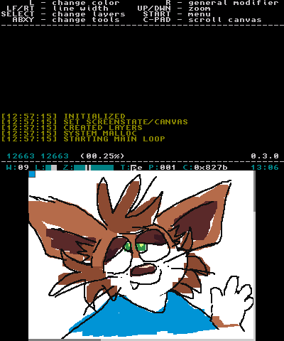

# 3ds_junkdraw 

An extremely simple drawing app for the 3DS. Focus is simplicity and ease of reimplementation.

## About
This started as an attempt at implementing a multiplayer drawing app. It was my first 3DS app and I
kind of gave up on it for several years. I figured that was a waste, so I cleaned it up and 
reduced the scope. It is currently just a simple drawing app, no multiplayer.

Some design decisions are based around [bugs in citro2d](https://github.com/devkitPro/citro2d/issues/31),
I'm sorry in advance.

## Controls

* **START** : menu
* **SELECT** : change layers
* **L** : color picker
* **A** : pencil tool
* **B** : eraser tool
* **UP/DOWN** : zoom in/out
* **LEFT/RIGHT** : change brush width
* **R+L** : change palette (the default is the one that starts with bright red followed by black)
* **R+LEFT/RIGHT** : REALLY change brush width
* **R+UP/DOWN** : change page (can have thousands)
* **R+L+UP/DOWN** : REALLY change page (please don't do this)
