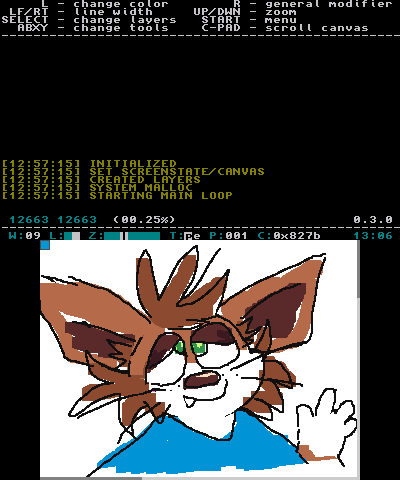

# 3ds_junkdraw 

An extremely simple drawing app for the 3DS. Focus is simplicity and ease of reimplementation.

## About
This started as an attempt at implementing a multiplayer drawing app. It was my first 3DS app and I
kind of gave up on it for several years. I figured that was a waste, so I cleaned it up and 
reduced the scope. It is currently just a simple drawing app, no multiplayer.

Some design decisions are based around [bugs in citro2d](https://github.com/devkitPro/citro2d/issues/31),
I'm sorry in advance.

## Controls

* **START** : menu
* **SELECT** : change layers
* **L** : color picker
* **A** : pencil tool
* **B** : eraser tool
* **Y** : slow pen tool
* **UP/DOWN** : zoom in/out
* **LEFT/RIGHT** : change brush width
* **R+L** : change palette (the default is the one that starts with bright red followed by black)
* **R+LEFT/RIGHT** : REALLY change brush width
* **R+UP/DOWN** : change page (can have hundreds)
* **R+L+UP/DOWN** : REALLY change page (please don't do this)
* **R+B/R+A** : Undo / Redo. Changing pages resets undo buffer

### Toggle-mode controls (optional)
* **A** : Change tool
* **X** : Undo
* **Y** : Redo
* **B** : Primary/secondary color (only available in toggle-mode)

## Features / limitations
* Paginated drawing capable of storing hundreds of pages per file
* 16 bit colors with no anti-aliasing or blending
* 9 banks of 64 color palettes, or a 3-slider RGB color picker
* 32 color history bank
* 2 layers with 1-bit transparency only
* Undo/redo (slowly)
* Saving/loading to a simple, somewhat-editable ASCII format
* PNG + GIF export
* Download exports in a PC/phone browser without exiting app
* Page editing (copy/swap/delete/etc)
* Animation mode with looping + onion skin

## Building

Some tools are missing from devkitpro:

- https://github.com/Epicpkmn11/bannertool : download and put in `/opt/devkitpro/bin/bannertool`
- https://github.com/3DSGuy/Project_CTR : download and put in `/opt/devkitpro/bin/makerom`

## Attribution
- [devkitpro](https://devkitpro.org/) for the toolchain
  - libctru
  - citro3d
- [bannertool](https://github.com/Epicpkmn11/bannertool) to make the banner
- [makerom](https://github.com/3DSGuy/Project_CTR) not really using but it's required
- [bell sound](https://opengameart.org/content/bell-arpeggio-24) cc0 but, it's the title music
- [Magic Draw](https://github.com/natsuneco/magic-draw) for additional inspiration and info on creating CIA files

Title art is my own

## Debugging

**NOTE: The html debugger currently only works for saves made before 0.5!!**

It's difficult to debug on the 3DS. As such, if you need to inspect the drawing data at a granular
level, drawing specific ranges of strokes, you can do so using [debug.html](debug.html).

### Directions for use
- Save your drawing as you normally do within 3ds junkdraw
- Copy the raw drawing (named `raw` inside the `/3ds/junkdraw/saves/<DRAWNAME>` folder) onto your computer. 
- Load [debug.html](debug.html) on your computer (save the file then open it in your browser)
- Use `Choose file` on the debug page to load your raw drawing. You will also need to click `Load`
- Once loaded, you will be able to inspect every stroke, as well as redraw any range of strokes you desire.

You can use this to "curate" specific ranges of strokes for export, or simply export entire pages for 
whatever reason. Please note that this is a debug page first and foremost, and won't be updated with
many ease of use features.

